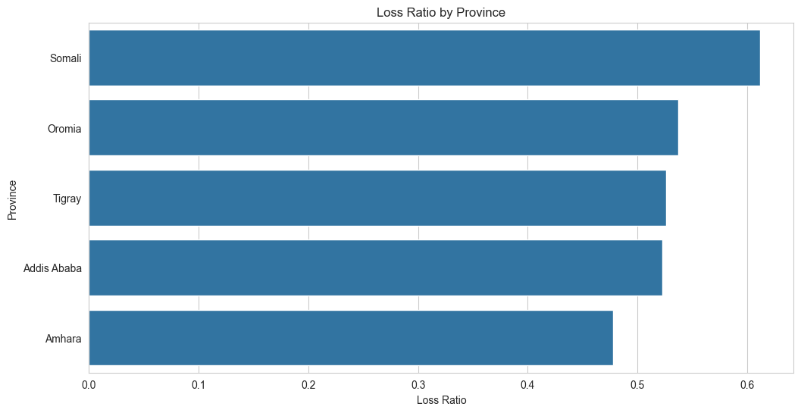
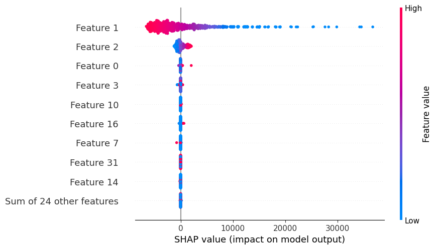
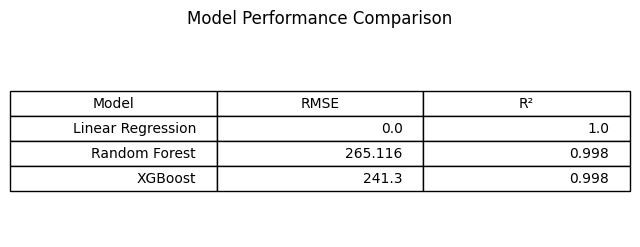

# End-to-End Insurance Risk Analytics & Predictive Modeling

## Project Overview

This project analyzes historical auto-insurance claim data for AlphaCare Insurance Solutions (ACIS) in South Africa.

The objective is to identify low-risk customer segments, evaluate profitability drivers, and develop predictive models that support risk-based pricing strategies.

The analysis covers:

- Exploratory Data Analysis (EDA)
- Data Version Control (DVC)
- Statistical Hypothesis Testing
- Predictive Modeling
- Model Interpretability using SHAP

---

## Business Problem

ACIS aims to optimize:

- Insurance pricing
- Marketing segmentation
- Portfolio profitability
- Risk management

The project investigates how customer demographics, vehicle characteristics, and geographic regions influence insurance risk and profitability.

---

## Key Metrics

### Loss Ratio

```python
LossRatio = TotalClaims / TotalPremium
```

Measures portfolio profitability and insurance risk.

### Margin

```python
Margin = TotalPremium - TotalClaims
```

Measures per-policy profitability contribution.

---

## Project Structure

```text
insurance-risk-analytics/
├── .github/workflows/
├── data/
├── notebooks/
├── src/
├── reports/
├── tests/
├── README.md
├── requirements.txt
└── .gitignore
```

---

## Tasks Completed

### Task 1 — Exploratory Data Analysis
- Data quality assessment
- Missing value analysis
- Univariate analysis
- Multivariate analysis
- Geographic trend analysis
- Outlier detection
- Loss ratio analysis
- Temporal claim trend analysis

### Task 2 — Data Version Control
- DVC initialization
- Local remote storage
- Dataset version tracking
- Reproducible data pipeline

### Task 3 — Hypothesis Testing
- Risk difference testing
- Margin comparison
- Statistical significance analysis

### Task 4 — Predictive Modeling
- Linear Regression
- Random Forest
- XGBoost
- SHAP interpretability

---

## Installation

Clone repository:

```bash
git clone <repo-url>
cd insurance-risk-analytics
```

Create environment:

```bash
python -m venv .venv
source .venv/bin/activate
```

Install dependencies:

```bash
pip install -r requirements.txt
```

---

## Running Notebooks

```bash
jupyter notebook
```

---

## DVC Reproducibility

Pull dataset versions:

```bash
dvc pull
```

Reproduce pipeline:

```bash
dvc repro
```

---
## DVC Reproducibility

Pull dataset versions:

```bash
dvc pull
```

Reproduce pipeline:

```bash
dvc repro
```

---

## Data Version Control with DVC

This project uses DVC to version large dataset files while keeping Git lightweight.

Tracked data files:

- `data/insurance_data.csv`
- `data/insurance_data_cleaned.csv`

The actual data files are stored in a local DVC remote storage directory, while Git tracks only the `.dvc` metadata files.

### Reproduce Data Setup

```bash
dvc pull
```

### Push Updated Data Versions

```bash
dvc push
```

### DVC Remote

```text
localstorage: ~/dvc-storage
```
## Key Visualizations

### Province Loss Ratio Analysis



### SHAP Feature Importance



### Model Performance Comparison



## Technologies Used

- Python
- Pandas
- NumPy
- Scikit-learn
- XGBoost
- SHAP
- DVC
- GitHub Actions
- Matplotlib
- Seaborn

---

## Author

Mariamawit Ewnetu Alemu  
10 Academy — Artificial Intelligence Mastery